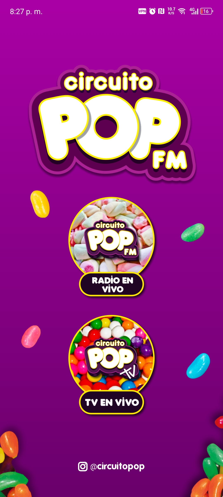
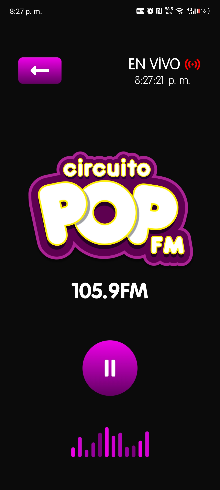
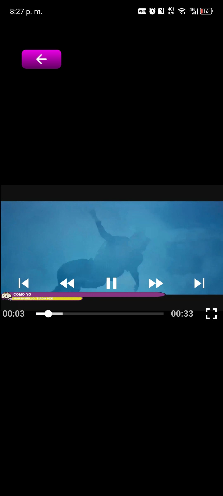

# 📱 Circuito Pop FM 105.9 - Mobile App (Radio & TV Streaming)

A cross-platform mobile application designed, developed, and deployed for **Circuito Pop FM 105.9**, available on both the **Google Play Store** 🤖 and **Apple App Store** 🍏. It offers live access to **radio and television** content through a modern and intuitive user interface.

---

## ✨ Features

### 🎛️ Interactive Home Screen

- Quick access to Radio and TV sections.
- Social media links.
- A decorative design aligned with the station's visual identity.

### 📻 Live Radio Player

- Real-time audio streaming.
- "LIVE" status indicator 🔴 with continuously updated local time ⏱️.
- Robust loading and connection error handling.

### 📺 Live TV Player

- Streaming from `m3u8` playlists.
- Fullscreen mode with orientation control.
- Loading and playback error indicators.

---

## 🛠️ Technologies Used

- ⚛️ **React Native Expo**: Cross-platform development with a single codebase.
- 🗺️ **Expo Router**: File-based navigation for streamlined development.
- 🔊 **Expo AV**: Audio and video streaming capabilities.
- 🎬 **react-native-video**: Native video playback with conditional fallback.
- 🔄 **react-native-orientation-locker**: Orientation control for immersive video experience.
- ⏳ **expo-splash-screen**: Animated and customizable launch screen.
- 🔗 **Native APIs**: External linking, real-time local time display, and device features.
- 🎨 **Figma**: UI design and interactive prototyping.

---

## 🚀 Achievements & Contributions

- 🎨 Designed the entire interface using **Figma**, then implemented it in **React Native**.
- 🔧 Solved complex challenges related to real-time audio and video playback, error handling, and performance optimization.
- 📤 Managed the entire **build and deployment** process for Android and iOS platforms.

---

## 📸 Screenshots

> Add your screenshots inside the `/assets` folder in the repository and replace the example paths below with your actual image paths:

| Home Screen                       | Live Radio Player                   | Live TV Player                |
| --------------------------------- | ----------------------------------- | ----------------------------- |
|  |  |  |

---

## 📲 Download the App

- ▶️ [Available on Google Play Store](https://lnkd.in/eFY2kt-4)
- 🍏 [Available on Apple App Store](https://lnkd.in/eDucb64y)

---

## 📩 Contact

Got feedback or suggestions? Feel free to reach out for technical support, improvements, or new feature development.

---

Thanks for visiting the repository! ⭐ If you like this project, consider leaving a star.
